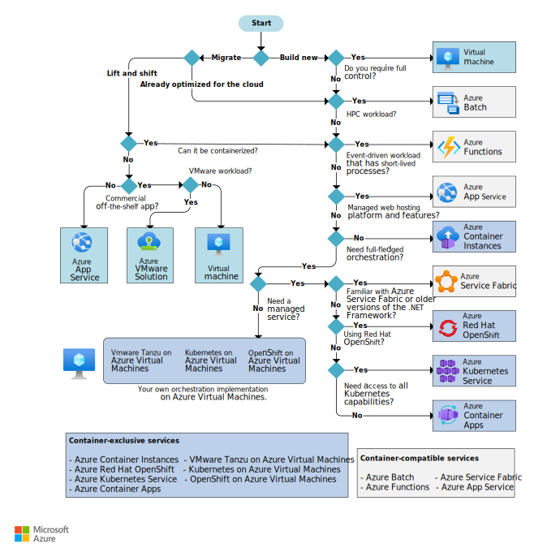
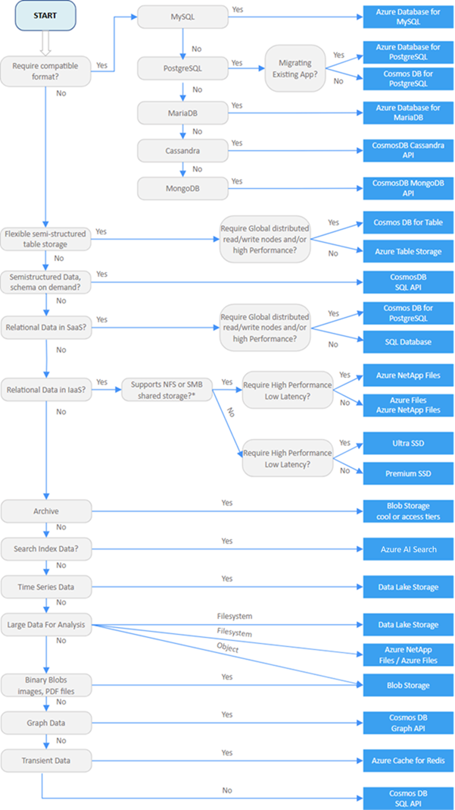

# Azure Decision Trees

## Choose a compute service

Use the following decision tree to help you choose a compute service for your
app, see the
[architecture center](https://learn.microsoft.com/en-us/azure/architecture/guide/technology-choices/compute-decision-tree)
for more details.

{ loading=lazy }

## Select a data store for your app

Use the following decision tree to help you choose a data store for your app,
see the
[architecture center](https://learn.microsoft.com/en-us/azure/architecture/guide/technology-choices/data-store-decision-tree)
for more details.

{ loading=lazy }

## Architectural Styles

The following list shows a set of architectural styles commonly found in cloud
applicaitons, see [Architectural Styles](https://learn.microsoft.com/en-us/azure/architecture/patterns/)
for more details.

Architecture style  | Dependency management  | Domain type
--- | --- | ---
N-tier | Horizontal tiers divided by subnet | Traditional business domain. Frequency of updates is low.
Web-queue-worker | Front and backend jobs, decoupled by async messaging. | Relatively simple domain with some resource intensive tasks.
Microservices | Vertically (functionally) decomposed services that call each other through APIs. | Complicated domain. Frequent updates.
Event-driven architecture | Producer/consumer. Independent view per sub-system. | IoT and real-time systems.
Big data | Divide a huge dataset into small chunks. Parallel processing on local datasets. | Batch and real-time data analysis. Predictive analysis using ML.
Big compute | Data allocation to thousands of cores. | Compute intensive domains such as simulation.
