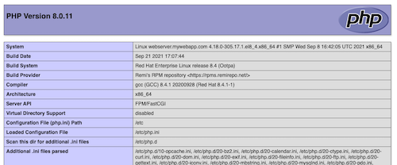

# Webapp Stack

## Goal

This project's goal is to setup a local LAMP-Stack to be able to install a
PHP/MySQL-based web application onto it. To learn a different aspects the
following assumptions are made:

* We pretend that the app will use quite some resources and therefore we need
  two linux servers:
  * *webserver* will run the Apache webserver and listen to HTTP requests (80
      first, 443 at a later stage)
  * *dbserver* is running the Mariadb database server and act as the database
      backend for the webapp
* The webserver needs to provide PHP 8 to be able to run PHP-based webapplications
* Communication to the Webserver is finally secured using SSL, which makes a
  x509-certificate necessary

You are free to choose the webapplication that you want to deploy. There are many
PHP-webapplications out there. A save choice might be a forum or a content management
system, i.e. [Flarum], [phpBB], [Wordpress], ...

[Flarum]: https://flarum.org/
[phpBB]: https://www.phpbb.com/
[Wordpress]: https://de.wordpress.org/

## Setup Local Virtual Servers

As we setup the local severs with the help of vagrant, we will generate at least
a Vagrantfile but for sure also scripts and the like. Therefore it's best to start
off with a versioned project dir, always, and keep in mind to create commits based
on steps we successfully carry out.

!!! abstract "Project initialization and local server setup"
    - Create a project dir
    - Initialize an empty git repo (use `gh repo` for that and enjoy its
      convienience :smile:)
    - Create the Vagrantfile
      - Initialize a new Vagrantfile using the vagrant command
      - Work with the rockylinux 8 basebox provided by geerlingguy (geerlingguy/rockylinux8)
      - Configure 2 severs in this Vagrant file: webserver and dbserver

Consider that the two linux server have to communicate with each other and you
want to connect to them from your browser and/or your CLI. Realize this using
the private networking feature (type internal networking) by adding an additional
network interface to the servers.
In addition you want to be able to consume the webiste from your host machine,
therefore, you have to **forward ports 80 and 443** of the guestOS to your laptop,
good local ports on the host OS could be 8080 and 8443.

## Provision the Databse Server

!!! abstract "Database server installation"
    1. **Install** the database server - either [MariaDB] or [MySQL] - using `dnf`
    1. **Configure** the database server using the ini files and
        - set default charet to *utf8mb4*
        - set default collation *utf8mb4_unicode_ci*
    1. **Secure** the server for production use - try to figure out, which steps
       to carry out!
    1. (optional): To be able to connect from your host system to your dbserver,
       you have to forward port 3306 to your host, i.e. to port 8306.

??? success "Solutions - Databse server installation"
    Please find my approach to the above tasks in the script
    [provision_dbserver.sh].  
    Regarding the charset question set every aspect to charset `utf8mb4` and
    collation `utf8mb4_unicode_ci`, see
    [my.cnf.d/charset.cnf]. For details of the configuration and the reasoning
    see [the guide on Charsets](../guides/misc.md).

Is it working? Can you connect from the database server itself? Is it no longer
possible to connect using user `root` with an empty password?

??? success "Solution - Connecting from host system to dbserver"
    First you need to install the mysql client binary. If you only want to connect
    to a remote DB server without having the need for a local DB server on the
    host itself, you can safely just install the client package `mysql-client`
    - else install `mariadb` that consists of the server and the client binaries.
    ```bash
    brew install mysql-client
    # As it is keg only, either force linkng:
    brew link mysql-client -f
    # or add the bin path to your $PATH variable, i.e.:
    echo 'export PATH="/usr/local/opt/mysql-client/bin:$PATH"' >> ~/.bash_profile

    ```

    Now you can connec to to the VMs using the mysql client binary. Use the IP
    address that you assigned in your `Vagrantfile`, in
    my case:
    ```bash
    mysql -h localhost -u demouser -p
    ```

    Does it work?

    !!! warning "Help, connecting to localhost does not work!"
        Connecting won't work if you want to connect to the forwarded port 3306 on your host machine. MariaDB/MySQL on macOS/Linux
        chooses to connect to a socket when connecting to `localhost` or when no server is specified. To connect using the TCP/IP
        protocol, you have to use an IP address. Don't forget to use the port that you actually used for port forwarding, in my
        case:
        ```bash
        mysql -h 127.0.0.1 --port 8306 -u demouser -p
        ```

[MariaDB]: https://mariadb.org/
[MySQL]: https://dev.mysql.com/
[provision_dbserver.sh]: https://github.com/mrolli/webappstack/blob/main/provision_dbserver.sh
[my.cnf.d/charset.cnf]: https://github.com/mrolli/webappstack/blob/main/my.cnf.d/charset.cnf

## Provision the Webserver

!!! abstract "Installing PHP-8"
    Next we want to be able to run web applications written in PHP. The latest
    available major version of PHP is version 8.

    !!! warning "PHP-8 not available"
        Rocky Linux 8 comes with PHP version 7.2, 7.3 and 7.4, which might be too old for some PHP webapps. But PHP 8 is not
        available in the repositories of the distribution (same goes for CentOS-8, RHEL-8).

    So, in order to have a current PHP-8 version, you either compile your own PHP (discouraged and not the way to go here) or
    use some other source of RPMs, e.g. a third-party yum repository. Search the net to find a reliable source for PHP-RPMs
    for RHEL-7 and derivates like Rocky Linux (Hint: Ratatouille). Even when you do not need PHP 8 yet, but your app requires
    PHP 7.4, you will have to familiarize yourself with the concept of [modularity](https://docs.pagure.org/modularity/).

    { align=right }

    Place the following script to `/var/www/html/index.php` and surf to <https://localhost:8080>.
    ```php
    <?php echo phpinfo();
    ```

    Is it working? You should see the follwoing webpage:

??? success "Solution - Installing Apache and PHP"
    Please find my approach to the above tasks in the script [provision_webserver.sh].
    Upon installation you should be able to load the page at the IP you defined
    in the Vagrantfile, in my case at <http://192.168.33.10/>. If you also forwarded
    the HTTP/HTTPS ports, then you can also load the same page at <http://localhost:8080>.

[provision_webserver.sh]: https://github.com/mrolli/webappstack/blob/main/provision_webserver.sh

## Deploy an Application

For the last step, there's no receipt that works for every application. There are
as many installation procedures as there are applications out there, but still
they share some archetypes:

* Place the files to the DocumentRoot (of a VirtualServer directive), import the
  database dump file
* Unpack the projecct files to the DocumentRoot and run an installer on the CLI
* Like above but run the installer by surfing to in the browser
* Run a command at the CLi to initiate a project and answer some questions
* and in between the example above every other possibility that one might imagine

!!! tip "... in a nutshell"
    Consult the manual and thoroughly follow it step by step.

!!! abstract "Final step"
    Finally, when your application of choice is working, prove that it does. For
    a CMS consider adding the sentence "Yes, I didi it" to the frontpage using
    the backend editor. Send a screenshot by mail to me!
