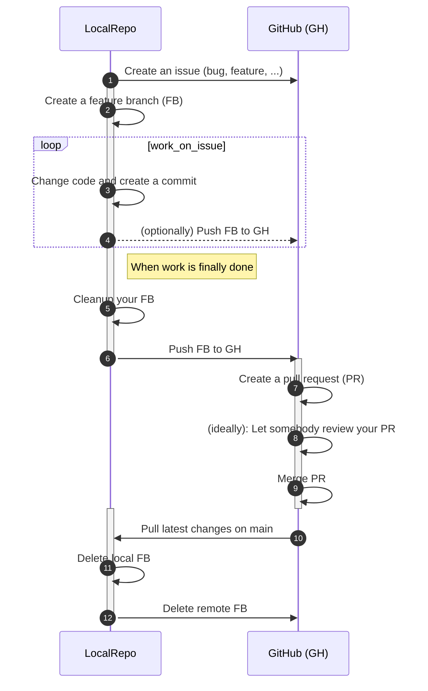

# GitHub

GitHub is a service to host repositories and provides a lot of
features/utilities around this task. There are many others but GitHub is the
oldest and probably most used. GitHub provides extensive documentation and
(video) guides, so in order to honor the DRY principle, only little text is
found here but instead a list of deep links to chapters and other learning
resources is provided here:

- [Training guides on GitHub and Git][gh-guides]
- [Video Guides on various topics](https://www.youtube.com/githubguides)
- [Create, cloning and archiving of repositories][gh-create]
- [Committing changes to your project][gh-commit]
- [Collaborating with pull requests / proposing changes to your work with PRs][gh-collaborate]
- [Proposing changes to your work with pull requests][gh-pullrequests]
- [Using the power of GitHub on the CLI][gh-cli]
- [GitHub Training Lab](https://lab.github.com/)
- [Visualizing Git](https://git-school.github.io/visualizing-git/)

## GitHub flow

While there are [many git workflows](gitworkflows.md) out there, having your
repository on GitHub make the [GitHub Flow][gh-flow] your first choice. As
explained on the [git workflows](gitworkflows.md) page, it's simple even for
bigger teams. The documentation on the Github flow primarily explains it from
technical point of view. The follow section workflow embeds these steps in an
example change.

### Complete Workflow

My philosophy is that every change should be documented from the beginning
to the end when it's implemented. A change could be a bug and its fix or a new
feature that is required and gets implemented. The order of action then is:



#### Comments on above diagram

1) Describe the bug/feature in several dimensions to make it possible to understand
the need to change something. Key questions are:

- What is broken?
- How does the error present itself?
- What are error messages that occur?
- What feature is missing?
- Which are the requirements that make the changes necessary?

<!-- markdownlint-disable MD029 -->
2) Name the branch accordingly i.e. `issue31`, `featureXY`, ...  
5) Cleanup the branch if needed by rewording, squashing, rearranging commits
   using  `git rebase --interactive` in order to have a history that makes
   sense.  
12) Get yourself a :beer: or move to the next ticket
<!-- markdownlint-restore -->

## GitHub Actions

Except for the following deep links into the official documentation, no other
information is available here as of yet.

- [Using workflows](https://docs.github.com/en/actions/using-workflows#creating-a-workflow-file)
- [Workflow Syntax for GitHub Actions](https://docs.github.com/en/actions/using-workflows/workflow-syntax-for-github-actions)
- [Supported platforms for action runners](https://docs.github.com/en/actions/using-workflows/workflow-syntax-for-github-actions#jobsjob_idruns-on)

## GitHub on the CLI

There is a wonderful, official [tool][gh-cli] written in Go that let's you do
all the GitHub related work on your CLI without the need to go to the browser.
No need to switch app, enter URLs, click through to the destination page you
need, just to open a new PR. All can be done in your Bash. See it [in
action][gh-cli].

The above illustrated workflow done using the tool `gh` might look as follos:

```bash
gh issue create --title "Thing X fails to compile" --assignee "@me" --label "bug" \
                --body "some longer text to sufficiently describe the bug"
gh checkout main
gh checkout -b bug_compile_error_in_X
# work on file
git add fileX
git ci -m "Fix compilation error"
git push origin bug_compile_error_in_X
gh pr create -t "The bug is fixed" -b "Everything works again"
gh pr merge
git checkout main
git pull origin main
git branch -d bug_compile_error_in_X
```

`gh` comes with an excellent [documentation](https://cli.github.com/manual/) and
local help, see `gh --help`.

## Community Health Files

TBD

[gh-create]: https://docs.github.com/en/github/creating-cloning-and-archiving-repositories
[gh-commit]: https://docs.github.com/en/github/committing-changes-to-your-project
[gh-collaborate]: https://docs.github.com/en/github/collaborating-with-pull-requests
[gh-pullrequests]: https://docs.github.com/en/github/collaborating-with-pull-requests/proposing-changes-to-your-work-with-pull-requests
[gh-cli]: https://cli.github.com/
[gh-guides]: https://guides.github.com/
[gh-flow]: https://guides.github.com/introduction/flow/
