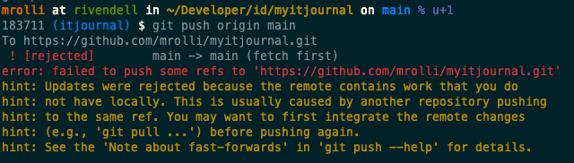

# Git Recipes

## My commit messages suck

**Symptom**

My colleagues and friends are notoriously complaining about my git commit
messages. But not only that, they also say that my commits suck pretty
often. My commits seem not to be atomic, include whitespace changes or
include too much stuff... but, what is a good commit with an equally good
commit message anyway?

**Discussion and Solution**

These topics have been discussed a lot and there thankfully is some
common sense about these issues and good write-ups have been done, well
worth reading:

* cbeams excellent [How to Write a Git Commit Message](https://cbea.ms/git-commit/)
  aka The seven rules of a great Git commit message
* Tim Pope's [Note About Git Commit Messages](https://tbaggery.com/2008/04/19/a-note-about-git-commit-messages.html)
* ProGit Book on [Contributing and Commit Guidelines](https://www.git-scm.com/book/en/v2/Distributed-Git-Contributing-to-a-Project#_commit_guidelines)
* Peter Hutterer's Blog Post [On commit messages](https://who-t.blogspot.com/2009/12/on-commit-messages.html)
  with how and how not to do git. Especially
  read the "How not to do it" section!

## `git push` rejected due to remote changes

**Symptom**

I have committed something (to the main branch) and forgot to pull
first. Now I can't push anymore as git rejects the push with the
following message:

!!! failure  "git push rejected"
    

**Discussion and Solution**

This usually means that somebody else already added a new commit and pushed to
GitHub and now your commit conflicts with the other. What to do now? You would
need to:

* Remove your commit(s) and keep the changes
* Run a `git pull --ff-only` to fetch the new commit from the other person
* Re-apply your changes again on top of the latest commit

!!! success "Solution"
    `git pull --rebase`

This command first fetches the latest commits and then rebases your commits on
top of the latest commit, see `git help pull`. Now you may try to push your changes.

## Damn, I committed a secret!

**Symptom**

You just committed a configuration file with a password in it? You entered a real
password into a file instead of a dummy password like `123456` and committed it?
You added disclosed something else by committing it to the repo? Fear not and
read ahead!

**Discussion and Solution**

There's good [cheat sheet from GitGuardian](../pdf/RewritingYourGitHistory-Cheatsheet.pdf)
that features a flow chart on how to proceed and save the situation depending on
the stage at which you realised that something wrong happened.

## Damn, I branched off wrong parent branch!

**Symptom**

You created a new feature branch and after some commits you realized that you
branched off a feature branch instead of the master/main branch?

The situation now looks like this, right?

    A---B---C---D  main
        \
          E---F---G  other-feature-branch
                  \
                    H---I---J new-feature-branch (HEAD)

**Discussion and Solution**

Well, you could create a new branch off main and then `git cherry-pick` all commits
over, which would work, but implies additional work, i.e. if you already have setup
a pull request and someone already reviewed the code as you would setup a new branch
and therefore also a new PR and the review would have to be done again...

But we can use git rebase --onto command. It can do exactly what we need.
Replace the old parent branch with new parent branch. In our case with main
branch.  
For the situation above, we would like to achieve this result:

    A---B---C---D  main
                |\
                | E---F---G  other-feature-branch
                |
                 \
                  H'---I'---J' new-feature-branch (HEAD)

To replace parent branch with master, we need to be on new-feature-branch branch
and do:

`git rebase --onto main other-feature-branch`

That’s it. Right now we have our current-feature-branch branch based on master
branch, not like before based on feature-branch.

In the end, I would like to say two more things here. First, the general form -
rebase some branch from one branch onto another looks like this:

!!! success "Solution"
    ```bash
    git checkout branch2move
    git rebase --onto new-parent old-parent

    ```

The destination branch comes first follow by the old branch. The branch that is
moved is the currently checked out!

Second, as you see one schema above, after using `git rebase --onto` we don’t have
exactly the same commit like before. Code is the same, but the SHA number (you know
the commit identifier, for example 2d4698b) for each commit is different. Everything
will be fine, when you work alone on the branch where you want to do the trick.
In case other people also work on this branch this command can provide problems as
always when you rewrite history and change commit hashes.

More on `git rebase --onto` can be found in [Git rebase --onto an overview](https://womanonrails.com/git-rebase-onto)

## Extract a Subfolder to Its Own Repository

**Symptom**

Sometimes you come to a point where a certain bit of your code grows that much
that you want it to manage in its own repository. Some common use cases might
include:

* A Submodule should now be its own library/plugin
* Puppet code deserves its own module
* An ansible playbook should be turned into its own role

You might say: "Well, create new repo, move the files over, check them in and
do the first commit. Done. Where's the problem?" What if I tell you, that moving
only the files is not enough. I'd want to also move the history of those files.
I want all the old commits where these files were referenced in the new repo too!

!!! success "Solution"
    It turns out that this is such a common and useful practice that the
    overlords of Git made it really easy. The magic command is `git subtree
    split`

    1. Prepare the old repo from where you want extract the subfolder, in this
       example the folder `lib/myparser`:

           ```
           cd path/to/bigrepo
           git subtree split -P lib/myparser -b myparser-only
           ```

        I now have a new branch `myparser-only` in the bigrepo, that exactly
        contains to contents and its histroy of this very folder. Yeah! Now let's
        create a now repo from that branch:

    1. Create the new repo and pull the prepared branch:
            ```
            mkdir path/to/myparser; cd path/to/myparser
            git init
            git pull path/to/bigrepo myparser-only
            ```
        The history has now been pull into the new repo.

    1. Time to attach the remote (already created at GH) and push:
            ```
            git remote add origin https://github.com/user/myparser
            git push -u origin main
            ```

    1. Cleanup inside the bigrepo and remove the extracted stuff:
            ```
            cd path/to/bigrepo
            git branch -D myparser-only
            git rm -rf lib/myparser
            git ci -m "Extraced myparser to its own repo"
            git push origin main
            ```
        You're done. [Original source](https://stackoverflow.com/questions/359424/detach-move-subdirectory-into-separate-git-repository)
