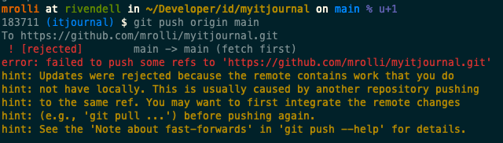

# Git

## Learning Git

* [Pro Git Book](https://git-scm.com/book/en/v2)
* [Visualizing Git](https://git-school.github.io/visualizing-git/)

## Configuration files

There are a number of configuration files that git offers and that let user customize their git experience in great depth. As usual
great powers comes with great responsibility. :wink: Not all configuration files and options are mentioned here, there
[are many more](https://git-scm.com/docs/git-config).

### First Time Git setup

This step is really important as you set some default behaviour and especially
you have to set to identity! This last step - configuring your identity often
is neglected. Please, don't. No go and read [first time git
setup](https://git-scm.com/book/en/v2/Getting-Started-First-Time-Git-Setup)

Keep in mind that you just set your global identity. Almost every configuation
key is also changeable on repo level. This means while your global identity may
be "MrCool <cool@test.com>", you can still have another identity on a per repo
basis, i.e. when implementing stuff for work. You can set your identity within
the repo directory by issuing:

    git config user.name  Max Mustermann
    git config user.email max.mustermann@superag.ch

As you can see, the same commando is run, but `--global` is left out. Now this
local setting can be found in the config file of the repo, see `.git/config` at
the top level of the repo itself.

Unsure what your identity is in the current repo? Just run `git config user.name` or `git config user.email` respectively.

### Repo-local configs

#### *gitignore* - Specifies intentionally untracked files to ignore

A gitignore file specifies intentionally untracked files that Git should ignore, see [man gitignore](https://git-scm.com/docs/gitignore) or in the [git-book](https://git-scm.com/book/en/v2/Git-Basics-Recording-Changes-to-the-Repository#_ignoring).

#### *gitattributes* - Defining attributes per path

A gitattributes file is a simple text file that gives attributes to pathnames, i.e. end of line style, see
[man gitattributes](https://git-scm.com/docs/gitattributes) or in the [git-book](https://git-scm.com/book/en/v2/Customizing-Git-Git-Attributes).

## Articles

#### **[The Thing About Git](https://tomayko.com/blog/2008/the-thing-about-git)**

Often beginners find it oddly strange that there is an index/staging area in Git and are not aware
for what this thing can be used. Other VCS do not have this. Nevertheless it's not an addition just
to make Git more complicated and to bother the developers. The "**Tangled Working Copy Problem**" illustrates
why this concept makes sense and how you should use it to your favor. There's one important option tot `git add`
that most beginners overlook (and tutorials almost never teach you), e.g. `--patch` or `-p`

Try the following form of adding files to the index next you have to do that and see what happens!
`git add --patch somepathspec` or `git add -p somepathspec`

## Recipes

### `git push` rejected due to remote changes

**Symptom**

I have committed something (to the main branch) and forgot to pull first. Now I can't push anymore as git
rejects the push with the following message:

!!! failure  "git push rejected"
    

**Discussion and Solution**

This usually means that somebody else already added a new commit and pushed to GitHub and now your commit
conflicts with the other. What to do now? You would need to:

* Remove your commit(s) and keep the changes
* Run a `git pull --ff-only` to fetch the new commit from the other person
* Re-apply your changes again on top of the latest commit

!!! success "Solution"
    `git pull --rebase`

This command first fetches the latest commits and then rebases your commits on top of the latest commit, see `git help pull`. Now you may try to push your changes.

### Damn, I committed a secret!

**Symptom**

You just committed a configuration file with a password in it? You entered a real password into a file instead of a dummy password like
`123456` and committed it? You added disclosed something else by committing it to the repo? Fear not and read ahead!

**Discussion and Solution**

There's good [cheat sheet from GitGuardian](../pdf/RewritingYourGitHistory-Cheatsheet.pdf) that features a flow chart on how
to proceed and save the situation depending on the stage at which you realised that something wrong happened.

### Damn, I branched off wrong parent branch!

**Symptom**

You created a new feature branch and after some commits you realized that you
branched off a feature branch instead of themaster/main branch?

The situation now looks like this, right?

    A---B---C---D  main
        \
          E---F---G  other-feature-branch
                  \
                    H---I---J new-feature-branch (HEAD)

**Discussion and Solution**

Well, you could create a new branch off main and then `git cherry-pick` all commits
over, which would work, but implies additional work, i.e. if you already have setup
a pull request and someone already reviewed the code as you would setup a new branch
and therefore also a new PR and the review would have to be done again...

But we can use git rebase --onto command. It can do exactly what we need.
Replace the old parent branch with new parent branch. In our case with main branch.  
For the situation above, we would like to achieve this result:

    A---B---C---D  main
                |\
                | E---F---G  other-feature-branch
                |
                 \
                  H'---I'---J' new-feature-branch (HEAD)

To replace parent branch with master, we need to be on new-feature-branch branch and do:

`git rebase --onto main other-feature-branch`

That’s it. Right now we have our current-feature-branch branch based on master
branch, not like before based on feature-branch.

In the end, I would like to say two more things here. First, if you want to move
from one parent to another the command should look like this:

!!! success "Solution"

    `git rebase --onto new-parent old-parent`

So right now you can adjust it to your situation.

Second, as you see one schema above, after using `git rebase --onto` we don’t have
exactly the same commit like before. Code is the same, but the SHA number (you know
the commit identifier, for example 2d4698b) for each commit is different. Everything
will be fine, when you work alone on the branch where you want to do the trick.
In case other people also work on this branch this command can provide problems as
always when you rewrite history and change commit hashes.

More on `git rebase --onto` can be found in [Git rebase --onto an overview](https://womanonrails.com/git-rebase-onto)
