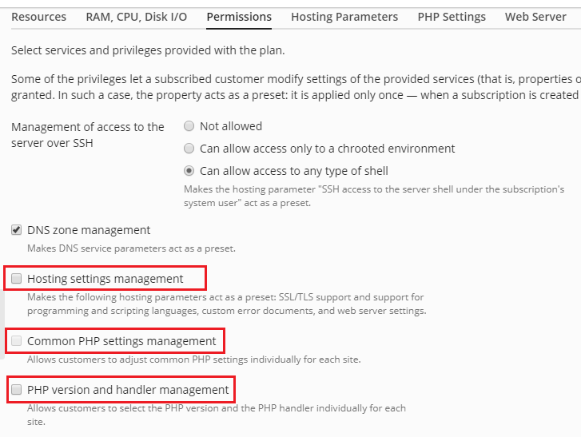

# Useful CLI Commands for Plesk

## Subscription/Site Management

### Domain Aliases

To create a domain alias that only redirects to the main domain without creating
a new site, use the following `domalias` command:

```bash
plesk bin domalias --create aliasdomain.net -domain maindomain.net
```

See [domalias: Domain Aliases for more information](https://docs.plesk.com/en-US/onyx/cli-linux/using-command-line-utilities/domalias-domain-aliases.38962/).

### Sync PHP settings/hosting settings with the service plan

**Symptoms**

PHP settings or hosting settings defined in a Service Plan are not changed for
subscription after successful synchronization with the service plan

**Cause**

Permissions Hosting settings management and Common PHP settings management are
enabled in the service plan. According to [Plesk
documentation](https://docs.plesk.com/en-US/obsidian/administrator-guide/appendix-a-properties-of-hosting-plans-and-subscriptions/permissions.65719/),
Hosting settings management option allows owner managing subscription's web
hosting settings. If this permission is granted, then the hosting parameters
will not be synced. This means that PHP or Hosting settings on the subscription
level have higher priority than on the service plan level.

**Resolution**

To make PHP settings to be synced with ones specified in the service plan:

1. Login into Plesk and navigate to **Service Plans > service_plan_name >
   Permissions tab**
1. Uncheck **Hosting settings management**, **Common PHP settings management**
   and **PHP version and handler management**



## User Management

### Create an Additional Administrator

```bash
PSA_PASSWORD="$password" plesk bin admin_alias \
  --create $username \
  -passwd '' \
  -contact "$display_name" \
  -comment "$comment" \
  -email "$email"
```

See [admin_alias: Additional Administrator
Accounts](https://docs.plesk.com/en-US/obsidian/cli-linux/using-command-line-utilities/admin_alias-additional-administrator-accounts.72489/)
for more information.

## Server Configuration

### Disable TLSv1 and TLSv1.1

```bash
# /usr/local/psa/bin/server_pref -s | grep ssl-protocols
ssl-protocols: TLSv1 TLSv1.1 TLSv1.2 TLSv1.3

/usr/local/psa/bin/server_pref -u -ssl-protocols "TLSv1.2 TLSv1.3"

# /usr/local/psa/bin/server_pref -s | grep ssl-protocols
ssl-protocols: TLSv1.2 TLSv1.3

## Other Commands

### Fail2Ban Management

```bash
# Show list of trusted IPs
plesk bin ip_ban -t

# Add additional IPs to the trusted list
plesk bin ip_ban --add-trusted "1.2.3.4 5.6.7.8 9.10.11.12"

# Show list of banned IPs
plesk bin ip_ban -b

# Unban an IP
plesk bin ip_ban --unban 1.2.3.4
```

See [ip_ban: IP Address
Banning (Fail2Ban)](https://docs.plesk.com/en-US/obsidian/cli-linux/using-command-line-utilities/ip_ban-ip-address-banning-fail2ban.73594/)
for more information.

## Domain Management

### Add www subdomain alias

To add a www variant (e.g., <www.sub.example.net>) that points to an existing subdomain:

```bash
plesk bin domalias --create www.sub.example.net -domain sub.example.net
```

### Update PHP-Handler for a subdomain or all subdomain

```bash
for site in $(plesk bin site --list); do
    plesk bin site -u $site -php_handler_id plesk-php84-fpm-dedicated;
done

```

### Redirect www to non-www

```nginx
if ($host ~ ^www\.(.+)$) {
    return 301 $scheme://$1$request_uri;
}

```

## Maintenance Tasks

### How to backup MariaDB databases via CLI

To find databases and dump it:

```bash
/usr/sbin/plesk db -e "show databases" | grep -v -E "^Database|information_schema|performance_schema|phpmyadmin|mysql|psa|roundcubemail|sys|apsc"
plesk db dump dbname > dbname.sql
```

To restore a dump:

```bash
MYSQL_PWD=`cat /etc/psa/.psa.shadow` mariadb -u admin < dbname.sql
```
